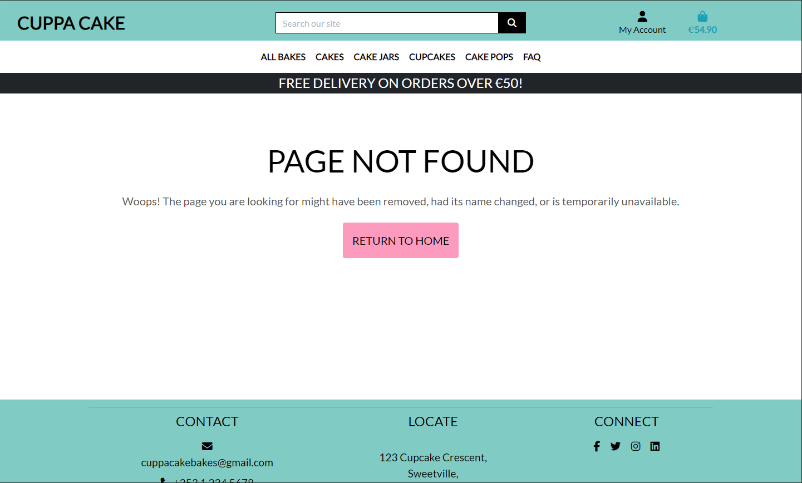
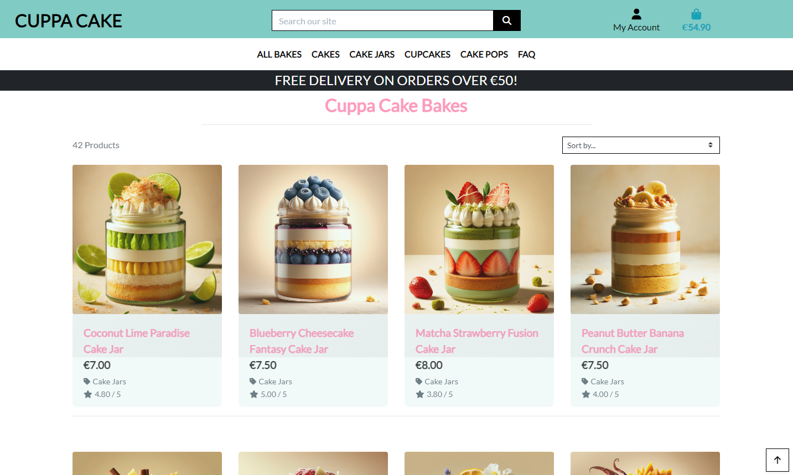
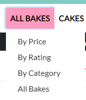
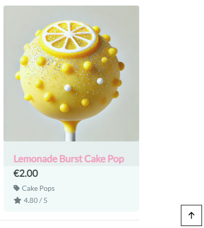

# Cuppa Cake

Cuppa Cake is an e-commerce platform that sells a variety of cakes, cake jars, cupcakes, and cake pops. The website allows customers to browse through a range of items, place orders, and contact the business for enquiries.

The live site can be viewed [here](https://cuppa-cake-66d9c1594728.herokuapp.com/).

## Overview
Cuppa Cake is built with Django, a high-level Python web framework, and uses PostgreSQL for the database. The platform is hosted on Heroku and uses Cloudinary for static and media files storage.

## Table of Contents
- [Cuppa Cake](#cuppa-cake)
  - [Overview](#overview)
  - [Table of Contents](#table-of-contents)
  - [User Experience](#user-experience)
    - [Agile Methodology](#agile-methodology)
    - [User Epics \& User Stories](#user-epics--user-stories)
  - [Design](#design)
    - [Wireframes](#wireframes)
      - [Landing Page](#landing-page)
      - [Product Page](#product-page)
      - [Product Details Page](#product-details-page)
      - [Shopping Cart Page](#shopping-cart-page)
      - [Register Page](#register-page)
      - [Log In Page](#log-in-page)
      - [Contact Page](#contact-page)
    - [Database Schema](#database-schema)
    - [Typography](#typography)
    - [Color Scheme](#color-scheme)
  - [Features](#features)
    - [Existing Features](#existing-features)
      - [General Navigation](#general-navigation)
        - [Navigation Bar](#navigation-bar)
        - [Landing Page](#landing-page-1)
        - [Header](#header)
        - [Footer](#footer)
          - [404 Page](#404-page)
      - [Authentication](#authentication)
        - [Registration](#registration)
        - [Login](#login)
        - [Logout](#logout)
      - [Profile](#profile)
        - [Profile Page](#profile-page)
        - [Edit Profile](#edit-profile)
      - [Products](#products)
        - [Product Page](#product-page-1)
        - [Product Interaction](#product-interaction)
        - [Search Products](#search-products)
        - [Filter Products](#filter-products)
        - [Sort Products](#sort-products)
        - [Back to Top Button](#back-to-top-button)
        - [Product Details](#product-details)
      - [Bag](#bag)
        - [Bag Page](#bag-page)
        - [Add to Bag](#add-to-bag)
        - [Remove from Bag](#remove-from-bag)
        - [Adjust Quantity](#adjust-quantity)
      - [Checkout](#checkout)
        - [Checkout Page](#checkout-page)
        - [Payment](#payment)
        - [Order Form](#order-form)
        - [Order Confirmation](#order-confirmation)
      - [Contact](#contact)
        - [Contact Page](#contact-page-1)
        - [Contact Form](#contact-form)
      - [Newsletter](#newsletter)
        - [Newsletter Signup](#newsletter-signup)
    - [Existing Admin Features](#existing-admin-features)
      - [Product Management](#product-management)
        - [Add Product](#add-product)
        - [Edit Product](#edit-product)
        - [Delete Product](#delete-product)
      - [Placeholder Image](#placeholder-image)
  - [Future Features](#future-features)
    - [Product Reviews:](#product-reviews)
    - [Minimum Order Quantity:](#minimum-order-quantity)
    - [Blog:](#blog)
    - [Newsletter:](#newsletter-1)
  - [Responsive Design](#responsive-design)
    - [Home Page](#home-page)
      - [Desktop](#desktop)
      - [Mobile](#mobile)
    - [Product Page](#product-page-2)
      - [Desktop](#desktop-1)
      - [Mobile](#mobile-1)
    - [Product Details Page](#product-details-page-1)
      - [Desktop](#desktop-2)
      - [Mobile](#mobile-2)
    - [FAQ Page](#faq-page)
      - [Desktop](#desktop-3)
      - [Mobile](#mobile-3)
    - [Contact Page](#contact-page-2)
      - [Desktop](#desktop-4)
      - [Mobile](#mobile-4)
    - [Register Page](#register-page-1)
      - [Desktop](#desktop-5)
      - [Mobile](#mobile-5)
    - [Login Page](#login-page)
      - [Desktop](#desktop-6)
      - [Mobile](#mobile-6)
    - [Log Out Page](#log-out-page)
      - [Desktop](#desktop-7)
      - [Mobile](#mobile-7)
    - [Profile Page](#profile-page-1)
      - [Desktop](#desktop-8)
      - [Mobile](#mobile-8)
    - [Shopping Cart Page](#shopping-cart-page-1)
      - [Desktop](#desktop-9)
      - [Mobile](#mobile-9)
    - [Checkout Page](#checkout-page-1)
      - [Desktop](#desktop-10)
      - [Mobile](#mobile-10)
    - [Order Confirmation Page](#order-confirmation-page)
      - [Desktop](#desktop-11)
      - [Mobile](#mobile-11)
    - [Newsletter Page](#newsletter-page)
      - [Desktop](#desktop-12)
      - [Mobile](#mobile-12)
  - [Web Marketing](#web-marketing)
    - [Advantages](#advantages)
    - [Target Audience](#target-audience)
    - [Marketing Strategy](#marketing-strategy)
  - [SEO](#seo)
    - [SEO and Content Strategy](#seo-and-content-strategy)
    - [Sitemap](#sitemap)
      - [sitemap.xml](#sitemapxml)
    - [robots.txt](#robotstxt)
  - [Technologies Used](#technologies-used)
    - [Languages](#languages)
    - [Libraries \& Frameworks](#libraries--frameworks)
    - [Tools](#tools)
    - [Databases](#databases)
    - [Hosting](#hosting)
    - [Version Control](#version-control)
  - [Testing](#testing)
    - [SEO Testing](#seo-testing)
    - [Code Validation](#code-validation)
    - [Manual Testing](#manual-testing)
    - [User Stories Testing](#user-stories-testing)
    - [Bugs](#bugs)
      - [Resolved Bugs](#resolved-bugs)
      - [Known Bugs](#known-bugs)
  - [Deployment](#deployment)
    - [Heroku Deployment](#heroku-deployment)
  - [Tools](#tools-1)
    - [IDE](#ide)
    - [Code Validation](#code-validation-1)
    - [Responsiveness](#responsiveness)
    - [Other Tools](#other-tools)
  - [Credits](#credits)
    - [Content](#content)
    - [Media](#media)
    - [Icons](#icons)
    - [Frame / Guide](#frame--guide)
    - [Information Resources](#information-resources)

## User Experience
### Agile Methodology
Cuppa Cake was developed using the Agile methodology, which emphasizes iterative development, collaboration, and flexibility. The site was divided into sprints, with each sprint focusing on specific features and user stories. The Agile methodology allowed for continuous feedback and improvements, ensuring that the final product meets user requirements and expectations.

### User Epics & User Stories
During the planning stage, several key epics were identified to structure the development process and ensure a comprehensive and user-centric design. Each epic is home to a series of user stories that define the scope and direction of the project. These stories are pivotal in guiding the development and ensuring that every feature contributes to a seamless and enjoyable user experience.

Each user story addresses the needs and expectations of our users and is organized within the project's kanban board, offering a detailed view of the development progress and priorities.

Below are the epics and user stories developed for Cuppa Cake, each aimed at enhancing the user experience and functionality of the platform:
1. User Registration & Authentication
    - User Registration
    - User Login
    - User Logout
    - Password Reset
2. Product Browsing & Search Functionality
    - Product Categories
    - Product Listing
    - Product Search
    - Product Filters
    - View Product Details
3. Product Reviews
    - View Customer Reviews
    - Review a Product
    - Edit a Review
    - Delete a Review
4. Shopping Cart & Checkout
    - Add to Cart
    - View Shopping Cart
    - Remove from Cart
    - Adjust Quantity
    - Proceed to Checkout
    - Enter Shipping Information
    - Enter Payment Information
    - Order Confirmation
5. Order Management
    - View Order History
    - View Order Details
    - Track Order Status
    - Cancel Order
    - Return Order
6. Admin Management
    - View Orders
    - Add Products
    - Remove Products
    - Edit Products
    - Manage User Accounts
7. Customer Support
    - Contact Form
    - FAQ Page
8. Marketing & Promotions
    - Email Newsletter Signup
    - Apply Discount Codes
    - Special Offers Page

## Design
### Wireframes

Wireframes were created using Figma to visualize the layout and design of the website. The wireframes provide a clear representation of the site's structure, navigation, and content, ensuring a consistent and user-friendly design.

#### Landing Page

#### Product Page

#### Product Details Page

#### Shopping Cart Page

#### Register Page

#### Log In Page

#### Contact Page

### Database Schema
The database schema was created using dbdiagram.io. The schema was created to show the relationships between the different models in the database.

### Typography

The primary font used for Cuppa Cake is 'Lato', a sans-serif typeface that offers a clean and modern look. The font is used throughout the site for headings, paragraphs, and buttons, ensuring a consistent and professional design.

### Color Scheme

The color scheme for Cuppa Cake is inspired by the colors of cakes and desserts. The primary colors used are aqua, grey, pink, and white, creating a warm and inviting atmosphere. The colors are used throughout the site to highlight important elements, create contrast, and enhance the overall design.

## Features
### Existing Features
#### General Navigation
##### Navigation Bar
The navigation bar is located at the top of the page and provides easy access to the main sections of the site. The navigation bar includes links to the home page, product categories, search functionality, user account, shopping cart, and contact page.

##### Landing Page
The landing page is the first page users see when they visit the site. The landing page includes a hero image, featured categories, and a call-to-action button to encourage users to explore the site.

##### Header
The header is located at the top of the page and includes the site logo, search bar, and user account options. The header is fixed at the top of the page, ensuring easy access to important features as users scroll through the site.

##### Footer
The footer is located at the bottom of the page and includes social media icons, address, and contact information.

###### 404 Page
A custom 404 page is displayed when users navigate to a page that does not exist. The 404 page includes a message informing users that the page is not found and a link to return to the home page.

#### Authentication
##### Registration
Users can create an account by providing their username, email address, and password. After registration, users can log in to their account to access additional features such as adding products to the shopping cart and placing orders.

##### Login
Users can log in to their account by providing their username and password. After logging in, users can access their account information, view order history, and manage their shopping cart.

##### Logout
Users can log out of their account by clicking the logout button. After logging out, users are redirected to the home page and must log in again to access their account.

#### Profile
##### Profile Page
Users can view and edit their profile information, including their contact number and address. The profile page also displays the user's order history and allows users to manage their shopping cart.

##### Edit Profile
Users can edit their profile information, including their contact number and address. 

After editing their profile, users can save the changes and update their account information.

#### Products
##### Product Page
The product page displays a list of products available for purchase. Users can view product details, add products to the shopping cart, and filter products by category.

##### Product Interaction
When users hover over a product, the curser changes to a pointer, a pink overlay appears, and the product zooms in slightly. This interaction provides visual feedback to users and encourages them to click on the product.

##### Search Products
Users can search for products by entering keywords in the search bar.

The search functionality allows users to find specific products quickly and easily.

##### Filter Products
Users can filter products to narrow down their search results. The filter functionality allows users to browse products by price, rating or category.

##### Sort Products
Users can sort products by price, rating, name or category. The sort functionality allows users to view products in ascending or descending order.

##### Back to Top Button
A back to top button is displayed at the bottom right corner of the page. When users scroll down the page, the button appears, allowing users to quickly return to the top of the page.

##### Product Details
Users can view detailed information about each product, including the product name, price, category, rating, description and image.

Users are able to add products to the shopping cart by clicking the "Add to Bag" button on the product details page.

#### Bag
##### Bag Page
The bag page displays a list of products added to the shopping bag. Users can view product details, adjust product quantities, and remove products from the bag.

##### Add to Bag
Users can add products to the shopping bag by clicking the "Add to Bag" button on the product details page. After adding a product to the bag, users can view the product in the shopping bag.

##### Remove from Bag
Users can remove products from the shopping bag by clicking the "Remove" button next to the product. After removing a product from the bag, users can update the shopping bag.

##### Adjust Quantity
Users can adjust the quantity of products in the shopping bag by entering the desired quantity in the quantity field. After adjusting the quantity, users can update the shopping bag.

#### Checkout
##### Checkout Page
The checkout page displays a summary of the order, including product details, shipping information, and payment information. Users can review the order details, enter shipping information, and proceed to payment.

##### Payment
Users can enter payment information, including credit card details, to complete the order. The payment form includes fields for credit card number, expiration date, and security code.

##### Order Form
Users can enter shipping information, including name, address, and contact number, to complete the order. The order form includes fields for shipping address, city, state, and postal code.

##### Order Confirmation
After completing the order, users receive an order confirmation with the order details. The order confirmation page displays a summary of the order and users can view their orders from thier profile.

#### Contact
##### Contact Page
The contact page displays contact information with a simple contact form. Users can send messages to the business by entering their name, email address, and message in the contact form.

##### Contact Form
Users can send messages to the business by entering their name, email address, and message in the contact form. After submitting the contact form, users receive a confirmation message.

#### Newsletter
##### Newsletter Signup
Users can sign up for the newsletter by providing their email address. After signing up, users receive email updates about new products, promotions, and special offers.

### Existing Admin Features

#### Product Management
Cuppa Cake includes admin features that allow admin users to manage products through a user-friendly interface. Admin users have full CRUD (Create, Read, Update, Delete) functionality for products, including adding, editing, and deleting products.

Admin users are provided with a user-friendly form for adding new products and updating existing products. This allows admin users to manage products efficiently and ensure that the site is up-to-date with the latest products, maintaining a high level of customer satisfaction.

##### Add Product
Admin users can add new products to the site by providing product information, including the category, flavour, sku, name, description, price, and image.

At the end of the add product form, admin users can choose to add the product to the site or cancel the action.

After adding a product, admin users are presented with a success message confirming that the product has been added to the site.

Admin users are also presented with an overview of the product details, including the product name, price, category, description, and image.

##### Edit Product
Admin users can edit existing products by updating product information, including the product category, flavour, sku, name, description, price, and image.

After clicking the "Edit" button, admin users are presented with the product details form, where they can update the product information. 

An alert is displayed to confirm that the product is being edited.

After editing a product, admin users are presented with a success message confirming that the product has been updated.

Admin users are also presented with an overview of the updated product details.

##### Delete Product
Admin users can delete products from the site by navigating to the desired product's details page and clicking the "Delete" button.

After clicking the "Delete" button, admin users are presented with a confirmation message to confirm the deletion of the product.

#### Placeholder Image
If a product does not have an image, a placeholder image is displayed on the product details page.

This ensures that all products are displayed consistently and that admin users can easily identify products without images.

## Future Features
### Product Reviews:
- Allow users to leave reviews and ratings for products.

- Display customer reviews on the product details page.

- Allow users to edit and delete their reviews.

### Minimum Order Quantity:
- Set a minimum order quantity for products.

- Display a message if the order quantity is below the minimum.

### Blog:
- Create a blog with articles about baking, recipes, and cake decorating.

- Share tips, tutorials, and inspiration for baking enthusiasts.

### Newsletter:
- Send regular newsletters with updates, promotions, and special offers.

- Include product recommendations, recipes, and baking tips in the newsletter.

## Responsive Design

Cuppa Cake is designed with a responsive layout that adapts to different screen sizes and devices. The site is optimized for desktop, tablet, and mobile devices, providing a seamless and consistent user experience across all platforms.

The responsive design ensures that the site is accessible and user-friendly on all devices, allowing users to browse products, place orders, and contact the business with ease.

### Home Page
#### Desktop

#### Mobile

### Product Page
#### Desktop

#### Mobile

### Product Details Page
#### Desktop

#### Mobile

### FAQ Page
#### Desktop

#### Mobile

### Contact Page
#### Desktop

#### Mobile

### Register Page
#### Desktop

#### Mobile

### Login Page
#### Desktop

#### Mobile

### Log Out Page
#### Desktop

#### Mobile

### Profile Page
#### Desktop

#### Mobile

### Shopping Cart Page
#### Desktop

#### Mobile

### Checkout Page
#### Desktop

#### Mobile

### Order Confirmation Page
#### Desktop

#### Mobile

### Newsletter Page
#### Desktop

#### Mobile

## Web Marketing
Cuppa Cake stands as a B2C e-commerce platform that targets customers looking for high-quality cakes, cake jars, cupcakes, and cake pops. The platform offers a range of products for different occasions, including birthdays, weddings, and special events. Cuppa Cake aims to provide customers with a convenient and enjoyable shopping experience, allowing them to browse through a variety of products, place orders, and contact the business for enquiries.

### Advantages
Cuppa Cake offers several advantages to customers, including:
- Wide range of products: Cuppa Cake offers a variety of cakes, cake jars, cupcakes, and cake pops for different occasions.
- Easy navigation: The site features a user-friendly design with easy navigation, allowing customers to browse through products and place orders.
- Secure payment: Cuppa Cake uses secure payment methods to ensure that customer transactions are safe and protected.
- Customer support: Cuppa Cake provides customer support through a contact form, allowing customers to send messages and enquiries to the business.
- Newsletter: Cuppa Cake offers a newsletter signup for customers to receive updates, promotions, and special offers.
- Responsive design: The site is responsive and displays correctly on all devices, providing a seamless shopping experience for customers.
- SEO: Cuppa Cake is optimized for search engines, allowing customers to find the site easily and increase visibility online.
- Social media: Cuppa Cake uses social media icons in the footer to connect with customers and promote products through social channels.

### Target Audience
Cuppa Cake targets customers looking for high-quality cakes, cake jars, cupcakes, and cake pops for different occasions. The platform is designed for customers who enjoy sweet treats and celebrating special occasions. Cuppa Cake aims to provide customers with a convenient and enjoyable shopping experience, allowing them to browse through products, place orders, and contact the business for enquiries.

### Marketing Strategy
- Newsletter: Cuppa Cake offers a newsletter signup for customers to receive updates, promotions, and special offers.
- Social media: Cuppa Cake uses social media icons in the footer to connect with customers and promote products through social channels.
- Content marketing: Cuppa Cake plans to create a blog with articles about baking, recipes, and cake decorating to engage customers and provide valuable content.
- Influencer marketing: Cuppa Cake aims to collaborate with influencers and bloggers to promote products and reach a wider audience.
- Facebook business page: Cuppa Cake has created a Facebook business page to connect with customers, share updates, and promote products through social media.

## SEO
### SEO and Content Strategy
Utilizing tools like Google Analytics and Ahrefs, we identify and target key search terms relevant to our product offerings. Our content strategy emphasizes Cuppa Cake's expertise and commitment to quality, positioning us as leaders in the baking industry. By creating engaging and informative content, we aim to attract and retain customers, build brand loyalty, and drive organic traffic to the site.

### Sitemap
#### sitemap.xml
Site map was generated using [XML Sitemaps](https://www.xml-sitemaps.com/) and then uploaded to the root directory of the site.

### robots.txt

The robots.txt file was created and uploaded to the root directory of the site.

## Technologies Used
### Languages
- HTML
- CSS
- JavaScript
- Python

### Libraries & Frameworks
- Django
- Bootstrap

### Tools
- Git
- GitHub
- Visual Studio Code

### Databases
- PostgreSQL

### Hosting
- Heroku

### Version Control
- Git

## Testing
### SEO Testing
- The site was tested using the Lighthouse tool in Chrome DevTools. With an average score of 90 for all pages.

### Code Validation
- Html was validated using the W3C validator. minor issues were found and will be resolved in future updates.
- CSS was validated using the W3C CSS validator. No issues were found.
- Python was validated using the Code Institute Python Linter. Minor issues with length of lines were found and will be resolved in future updates.
- JSHint was used to validate the JavaScript. No issues were found.

### Manual Testing
| Test | Description | method | Expected Result | Actual Result | Pass/Fail |
|------|-------------|--------|-----------------|---------------|-----------|
| 1 | Navigation Bar | Click on each link in the navigation bar | The page should navigate to the corresponding section | The page navigated to the correct section | Pass |
| 2 | Registration | Register a new user account | The user should be able to register a new account | The user was able to register a new account | Pass |
| 3 | Login | Log in to the user account | The user should be able to log in to the account | The user was able to log in to the account | Pass |
| 4 | Logout | Log out of the user account | The user should be able to log out of the account | The user was able to log out of the account | Pass |
| 5 | Profile | View and edit user profile | The user should be able to view and edit their profile | The user was able to view and edit their profile | Pass |
| 6 | Products | View product details | The user should be able to view product details | The user was able to view product details | Pass |
| 7 | Bag | Add products to the shopping bag | The user should be able to add products to the shopping bag | The user was able to add products to the shopping bag | Pass |
| 8 | Bag | Remove products from the shopping bag | The user should be able to remove products from the shopping bag | The user was able to remove products from the shopping bag | Pass |
| 9 | Bag | Adjust product quantity in the shopping bag | The user should be able to adjust product quantity in the shopping bag | The user was able to adjust product quantity in the shopping bag | Pass |
| 10 | Checkout | Proceed to checkout | The user should be able to proceed to checkout | The user was able to proceed to checkout | Pass |
| 11 | Checkout | Enter shipping information | The user should be able to enter shipping information | The user was able to enter shipping information | Pass |
| 12 | Checkout | Enter payment information | The user should be able to enter payment information | The user was able to enter payment information | Pass |
| 13 | Checkout | Order confirmation | The user should receive an order confirmation message | The user received an order confirmation message | Pass |
| 14 | Contact | Send message to the business | The user should be able to send a message to the business | The user was able to send a message to the business | Pass |
| 15 | Newsletter | Sign up for the newsletter | The user should be able to sign up for the newsletter | The user was able to sign up for the newsletter | Pass |
| 16 | View orders | View order history | The user should be able to view order history | The user was able to view order history | Pass |
| 17 | Update delivery address | Update delivery address | The user should be able to update delivery address | The user was able to update delivery address | Pass |
| 18 | Search products | Search for products | The user should be able to search for products | The user was able to search for products | Pass |
| 19 | Filter products | Filter products by category | The user should be able to filter products by category | The user was able to filter products by category | Pass |
| 20 | Filter products | Filter products by price | The user should be able to filter products by price | The user was able to filter products by price | Pass |
| 21 | Filter products | Filter products by rating | The user should be able to filter products by rating | The user was able to filter products by rating | Pass |
| 22 | Sub categories | View sub categories | The user should be able to view sub categories | The user was able to view sub categories | Pass |
| 23 | Admin | Add products | The admin user should be able to add products | The admin user was able to add products | Pass |
| 24 | Admin | Edit products | The admin user should be able to edit products | The admin user was able to edit products | Pass |
| 25 | Admin | Delete products | The admin user should be able to delete products | The admin user was able to delete products | Pass |
| 26 | 404 page | Navigate to a non-existent page | The user should see a 404 page | The user saw a 404 page | Pass |
| 27 | Responsive design | View the site on different devices | The site should be responsive and display correctly on all devices | The site was responsive and displayed correctly on all devices | Pass |

### User Stories Testing
- Throughout the development process, user stories were tested to ensure that the site meets user requirements and expectations. The user stories were organized into epics and prioritized based on user needs and feedback. The user stories were tested using manual testing and user feedback to ensure that the site is user-friendly and functional.

### Bugs
#### Resolved Bugs
- Decrement button on the bag page was not working correctly on larger screens. The issue was resolved by updating the decrement button functionality to adjust the quantity of products in the shopping bag.

#### Known Bugs
- Images hosted on Cloudinary are using http instead of https, this is causing a mixed content error in the console. This is a known issue with Cloudinary and is being worked on by the Cloudinary team. The images are still being displayed correctly on the site.

## Deployment
### Heroku Deployment
1. Create a Heroku account by going to https://signup.heroku.com/
2. Create a new app by clicking the "New" button in the top right corner and then click "Create new app".
3. Enter a name for the app and select the region closest to you.
4. Click the "Create app" button.
5. Select "settings" from the top menu.
6. Click the "Reveal Config Vars" button.
7. Enter the following environment variables with your values:
  - STRIPE_PUBLIC_KEY
  - STRIPE_SECRET_KEY
  - STRIPE_WH_SECRET
  - SECRET_KEY
  - EMAIL_HOST_PASS
  - EMAIL_HOST_USER
  - CLOUDINARY_URL
  - DATABASE_URL
8. Click buildpacks from the top menu.
9. Add the following buildpacks:
  - heroku/python
10. Click the "Deploy" tab from the top menu.
11. Click the "Connect to GitHub" button.
12. Enter https://github.com/TerraBite147/KeyCraft.git and click the "Connect" button.
13. Click the "Enable Automatic Deploys" button.
14. Click the "Deploy Branch" button.
15. Click the "View" button to launch the app.

## Tools
### IDE
[Gitpod](https://www.gitpod.io/) - IDE application used to develop code in.

### Code Validation
- [W3C Validator](https://validator.w3.org/) - Validator that checks the markup validity for Web Documents in HTML.

- [W3C CSS Validator](https://jigsaw.w3.org/css-validator/) - Validator that checks CSS validity.

- [JSHint](https://jshint.com/) - JavaScript Validator.

- [Code Institute's Python Linter](https://pep8ci.herokuapp.com/) - Validator that checks syntax and stylistic problems in Python code.

### Responsiveness
- [Am I Responsive](https://ui.dev/amiresponsive) - Generates responsive images for your website.

### Other Tools
- [Chrome DevTools and Lighthouse](https://developer.chrome.com/docs/devtools/) - Web Developer Tools.

- [DB Diagram](https://dbdiagram.io/home) - Database Schema Design Tool.

## Credits
### Content
The content for the site was written by the developer.

### Media
The product images and favicon were generated using [ChatGPT](https://chatgpt.com/).

### Icons
[Font Awesome](https://fontawesome.com/) - Used for all icons on the site.

### Frame / Guide
The Code Institue Boutique Ado walkthrough project was utilized as a frame and guide for the development of this site.

### Information Resources
- [W3Schools - Python](https://www.w3schools.com/python/)
- [Stack Overflow](https://stackoverflow.com/)
- [Youtube](https://youtube.com/)