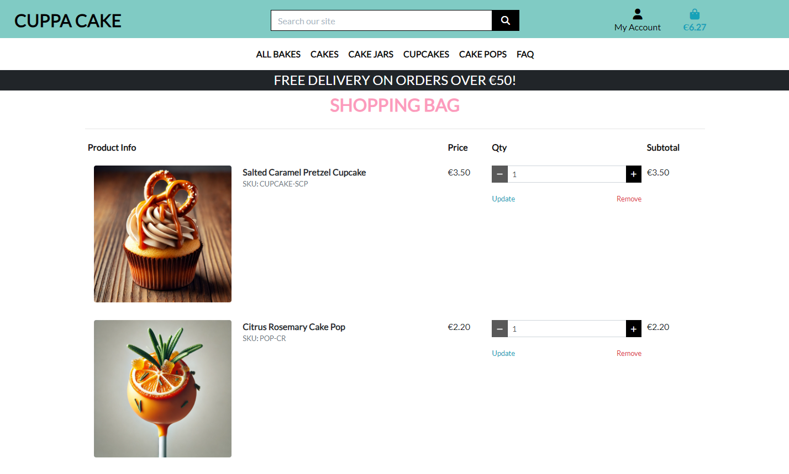
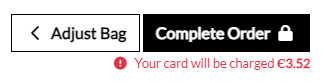
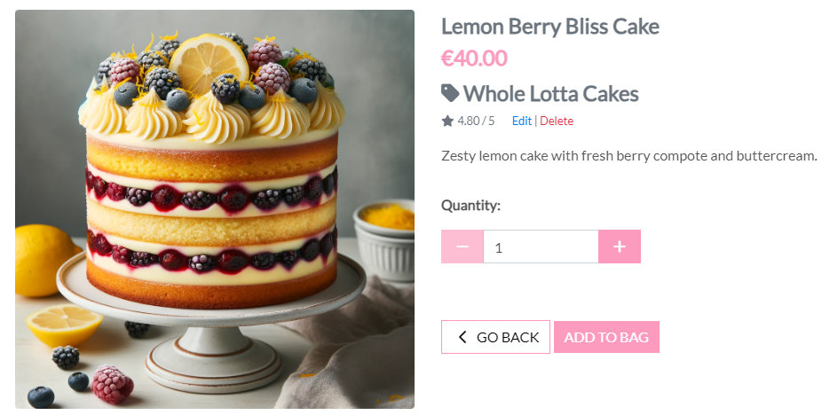
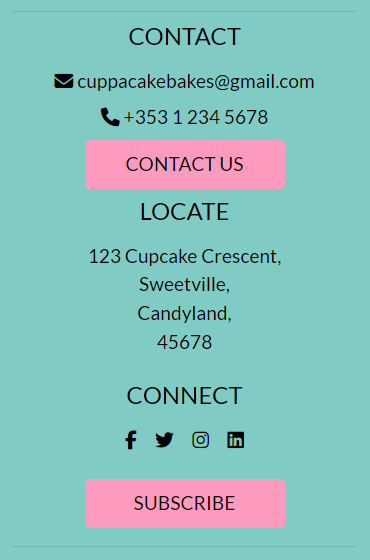
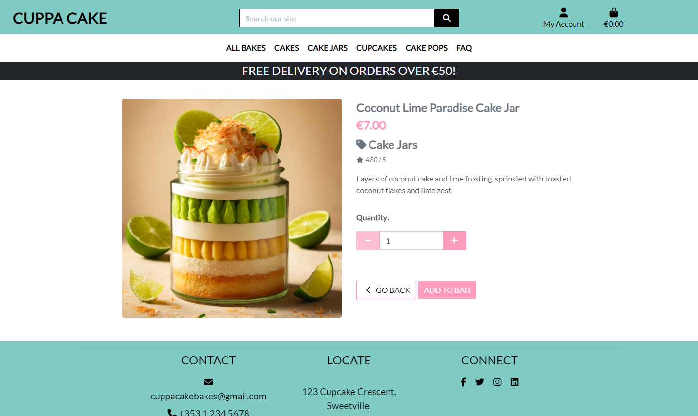

# Cuppa Cake

Cuppa Cake is an e-commerce platform that sells a variety of cakes, cake jars, cupcakes, and cake pops. The website allows customers to browse through a range of items, place orders, and contact the business for enquiries.

The live site can be viewed [here](https://cuppa-cake-66d9c1594728.herokuapp.com/).

## Overview
Cuppa Cake is built with Django, a high-level Python web framework, and uses PostgreSQL for the database. The platform is hosted on Heroku and uses Cloudinary for static and media files storage.

## Table of Contents
- [Cuppa Cake](#cuppa-cake)
  - [Overview](#overview)
  - [Table of Contents](#table-of-contents)
  - [User Experience](#user-experience)
    - [Agile Methodology](#agile-methodology)
    - [User Epics \& User Stories](#user-epics--user-stories)
  - [Design](#design)
    - [Wireframes](#wireframes)
      - [Landing Page](#landing-page)
      - [Product Page](#product-page)
      - [Product Details Page](#product-details-page)
      - [Shopping Bag Page](#shopping-bag-page)
      - [Register Page](#register-page)
      - [Sign In Page](#sign-in-page)
      - [Contact Page](#contact-page)
    - [Database Schema](#database-schema)
    - [Typography](#typography)
    - [Color Scheme](#color-scheme)
  - [Features](#features)
    - [Existing Features](#existing-features)
      - [General Navigation](#general-navigation)
        - [Navigation Bar](#navigation-bar)
        - [Landing Page](#landing-page-1)
        - [Header](#header)
        - [Footer](#footer)
        - [404 Page](#404-page)
      - [Authentication](#authentication)
        - [Registration / Sign Up](#registration--sign-up)
        - [Sign In](#sign-in)
        - [Sign Out](#sign-out)
      - [Profile](#profile)
        - [Profile Page](#profile-page)
        - [Edit Profile](#edit-profile)
      - [Products](#products)
        - [Product Page](#product-page-1)
        - [Product Interaction](#product-interaction)
        - [Search Products](#search-products)
        - [Filter Products](#filter-products)
        - [Sort Products](#sort-products)
        - [Back to Top Button](#back-to-top-button)
        - [Product Details](#product-details)
      - [Shopping Bag](#shopping-bag)
        - [Shopping Bag Page](#shopping-bag-page-1)
        - [Add to Shopping Bag](#add-to-shopping-bag)
        - [Remove from Bag](#remove-from-bag)
        - [Adjust Quantity](#adjust-quantity)
      - [Checkout](#checkout)
        - [Checkout Page](#checkout-page)
        - [Checkout Form](#checkout-form)
          - [Fill Out Field Alert](#fill-out-field-alert)
          - [Email Format Alert](#email-format-alert)
          - [Country Alert \& Dropdown](#country-alert--dropdown)
        - [Payment](#payment)
          - [Card Number Alert](#card-number-alert)
          - [Card Details Alert](#card-details-alert)
        - [Complete Order](#complete-order)
        - [Order Processing](#order-processing)
        - [Order Confirmation](#order-confirmation)
      - [Contact](#contact)
        - [Contact Page](#contact-page-1)
        - [Contact Form](#contact-form)
      - [Newsletter](#newsletter)
    - [Existing Admin Features](#existing-admin-features)
      - [Product Management](#product-management)
        - [Add Product](#add-product)
        - [Edit Product](#edit-product)
        - [Delete Product](#delete-product)
      - [Placeholder Image](#placeholder-image)
  - [Future Features](#future-features)
    - [Product Reviews:](#product-reviews)
    - [Minimum Order Quantity:](#minimum-order-quantity)
    - [Blog:](#blog)
    - [Regular Newsletters:](#regular-newsletters)
    - [FAQ CRUD:](#faq-crud)
  - [Responsive Design](#responsive-design)
    - [Landing Page](#landing-page-2)
      - [Desktop](#desktop)
      - [Mobile](#mobile)
    - [Header \& Navigation Bar](#header--navigation-bar)
      - [Desktop](#desktop-1)
      - [Mobile](#mobile-1)
    - [About Section](#about-section)
      - [Desktop](#desktop-2)
      - [Mobile](#mobile-2)
    - [Footer](#footer-1)
      - [Desktop](#desktop-3)
      - [Mobile](#mobile-3)
    - [Product Page](#product-page-2)
      - [Desktop](#desktop-4)
      - [Mobile](#mobile-4)
    - [Product Details Page](#product-details-page-1)
      - [Desktop](#desktop-5)
      - [Mobile](#mobile-5)
    - [FAQ Page](#faq-page)
      - [Desktop](#desktop-6)
      - [Mobile](#mobile-6)
    - [Contact Page](#contact-page-2)
      - [Desktop](#desktop-7)
      - [Mobile](#mobile-7)
    - [Register Page](#register-page-1)
      - [Desktop](#desktop-8)
      - [Mobile](#mobile-8)
    - [Sign In Page](#sign-in-page-1)
      - [Desktop](#desktop-9)
      - [Mobile](#mobile-9)
    - [Sign Out Page](#sign-out-page)
      - [Desktop](#desktop-10)
      - [Mobile](#mobile-10)
    - [Profile Page](#profile-page-1)
      - [Desktop](#desktop-11)
      - [Mobile](#mobile-11)
    - [Shopping Bag Page](#shopping-bag-page-2)
      - [Desktop](#desktop-12)
      - [Mobile](#mobile-12)
    - [Shopping Bag Update Window](#shopping-bag-update-window)
      - [Desktop](#desktop-13)
      - [Mobile](#mobile-13)
    - [Checkout Page](#checkout-page-1)
      - [Desktop](#desktop-14)
      - [Mobile](#mobile-14)
    - [Order Confirmation Page](#order-confirmation-page)
      - [Desktop](#desktop-15)
      - [Mobile](#mobile-15)
    - [Viewing Order History](#viewing-order-history)
      - [Desktop](#desktop-16)
      - [Mobile](#mobile-16)
    - [Viewing Order Details](#viewing-order-details)
      - [Desktop](#desktop-17)
      - [Mobile](#mobile-17)
    - [Newsletter Page](#newsletter-page)
      - [Desktop](#desktop-18)
      - [Mobile](#mobile-18)
  - [Web Marketing](#web-marketing)
    - [Advantages](#advantages)
    - [Target Audience](#target-audience)
    - [Marketing Strategy](#marketing-strategy)
  - [SEO](#seo)
    - [SEO and Content Strategy](#seo-and-content-strategy)
    - [Sitemap](#sitemap)
      - [sitemap.xml](#sitemapxml)
    - [robots.txt](#robotstxt)
  - [Testing](#testing)
    - [SEO Testing](#seo-testing)
    - [Code Validation](#code-validation)
    - [Manual Testing](#manual-testing)
      - [Navigation Bar](#navigation-bar-1)
      - [Home Page](#home-page)
      - [Footer](#footer-2)
      - [Product Page](#product-page-3)
      - [Product Details Page](#product-details-page-2)
      - [Admin Product CRUD](#admin-product-crud)
      - [Admin Portal](#admin-portal)
      - [User Account](#user-account)
      - [Contact Page](#contact-page-3)
      - [Newsletter](#newsletter-1)
    - [User Stories Testing](#user-stories-testing)
    - [Bugs](#bugs)
      - [Resolved Bugs](#resolved-bugs)
      - [Known Bugs](#known-bugs)
  - [Deployment](#deployment)
    - [Heroku Deployment](#heroku-deployment)
  - [Technologies Used](#technologies-used)
    - [Languages](#languages)
    - [Libraries \& Frameworks](#libraries--frameworks)
    - [Tools](#tools)
    - [Databases](#databases)
    - [Hosting](#hosting)
    - [Version Control](#version-control)
  - [Tools](#tools-1)
    - [IDE](#ide)
    - [Responsiveness](#responsiveness)
    - [Other Tools](#other-tools)
  - [Credits](#credits)
    - [Content](#content)
    - [Media](#media)
    - [Icons](#icons)
    - [Frame / Guide](#frame--guide)
    - [Information Resources](#information-resources)

## User Experience
### Agile Methodology
Cuppa Cake was developed using the Agile methodology, which emphasizes iterative development, collaboration, and flexibility. The site was divided into sprints, with each sprint focusing on specific features and user stories. The Agile methodology allowed for continuous feedback and improvements, ensuring that the final product meets user requirements and expectations.

### User Epics & User Stories
During the planning stage, several key epics were identified to structure the development process and ensure a comprehensive and user-centric design. Each epic is home to a series of user stories that define the scope and direction of the project. These stories are pivotal in guiding the development and ensuring that every feature contributes to a seamless and enjoyable user experience.

Each user story addresses the needs and expectations of our users and is organized within the project's kanban board, offering a detailed view of the development progress and priorities.

Below are the epics and user stories developed for Cuppa Cake, each aimed at enhancing the user experience and functionality of the platform:
1. User Registration & Authentication
    - User Registration
    - User Sign In
    - User Sign Out
    - Password Reset
2. Product Browsing & Search Functionality
    - Product Categories
    - Product Listing
    - Product Search
    - Product Filters
    - View Product Details
3. Product Reviews
    - View Customer Reviews
    - Review a Product
    - Edit a Review
    - Delete a Review
4. Shopping Bag & Checkout
    - Add to Bag
    - View Shopping Bag
    - Remove from Bag
    - Adjust Quantity
    - Proceed to Checkout
    - Enter Shipping Information
    - Enter Payment Information
    - Order Confirmation
5. Order Management
    - View Order History
    - View Order Details
    - Track Order Status
    - Cancel Order
    - Return Order
6. Admin Management
    - View Orders
    - Add Products
    - Remove Products
    - Edit Products
    - Manage User Accounts
7. Customer Support
    - Contact Form
    - FAQ Page
8. Marketing & Promotions
    - Email Newsletter Signup
    - Apply Discount Codes
    - Special Offers Page

## Design
### Wireframes

Wireframes were created using Figma to visualize the layout and design of the website. The wireframes provide a clear representation of the site's structure, navigation, and content, ensuring a consistent and user-friendly design.

#### Landing Page

#### Product Page

#### Product Details Page

#### Shopping Bag Page

#### Register Page

#### Sign In Page

#### Contact Page

### Database Schema
The database schema was created using dbdiagram.io. The schema was created to show the relationships between the different models in the database.

### Typography

The primary font used for Cuppa Cake is 'Lato', a sans-serif typeface that offers a clean and modern look. The font is used throughout the site for headings, paragraphs, and buttons, ensuring a consistent and professional design.

### Color Scheme

The color scheme for Cuppa Cake is inspired by the colors of cakes and desserts. The primary colors used are aqua, grey, pink, and white, creating a warm and inviting atmosphere. The colors are used throughout the site to highlight important elements, create contrast, and enhance the overall design.

## Features
### Existing Features
#### General Navigation
##### Navigation Bar
The navigation bar is located at the top of the page and provides easy access to the main sections of the site. The navigation bar includes links to the home page, product categories, search functionality, user account, shopping bag, and contact page.

##### Landing Page
The landing page is the first page users see when they visit the site. The landing page includes a hero image, featured categories, and a call-to-action button to encourage users to explore the site.

##### Header
The header is located at the top of the page and includes the site logo, search bar, and user account options. The header is fixed at the top of the page, ensuring easy access to important features as users scroll through the site.

##### Footer
The footer is located at the bottom of the page and includes social media icons, address, and contact information.

##### 404 Page
A custom 404 page is displayed when users navigate to a page that does not exist. The 404 page includes a message informing users that the page is not found and a link to return to the home page.

#### Authentication
##### Registration / Sign Up
Users can create an account by providing their username, email address, and password. After signing up, users can sign in to their account to access additional features such as adding products to the shopping bag and placing orders.

##### Sign In
Users can sign in to their account by providing their username and password. After signing in, users can access their account information and view order history.

##### Sign Out
Users can sign out of their account by clicking the "Sign Out" button. After signing out, users are redirected to the home page and must sign in again to access their account.

#### Profile
##### Profile Page
Users can view and edit their profile information, including their contact number and address. The profile page also displays the user's order history and allows users to manage their shopping bag.

##### Edit Profile
Users can edit their profile information, including their contact number and address. 

After editing their profile, users can save the changes and update their account information.

#### Products
##### Product Page
The product page displays a list of products available for purchase. Users can view product details, add products to the shopping bag, and filter products by category.

##### Product Interaction
When users hover over a product, the curser changes to a pointer, a pink overlay appears, and the product zooms in slightly. This interaction provides visual feedback to users and encourages them to click on the product.

##### Search Products
Users can search for products by entering keywords in the search bar.

The search functionality allows users to find specific products quickly and easily.

##### Filter Products
Users can filter products to narrow down their search results. The filter functionality allows users to browse products by price, rating or category.

##### Sort Products
Users can sort products by price, rating, name or category. The sort functionality allows users to view products in ascending or descending order.

##### Back to Top Button
A back to top button is displayed at the bottom right corner of the page. When users scroll down the page, the button appears, allowing users to quickly return to the top of the page.

##### Product Details
Users can view detailed information about each product, including the product name, price, category, rating, description and image.

Users are able to add products to the shopping bag by clicking the "Add to Bag" button on the product details page.

#### Shopping Bag
##### Shopping Bag Page
The shopping bag page displays a list of products added to the bag. Users can view product details, adjust product quantities, and remove products from the bag.

##### Add to Shopping Bag
Users can add products to the shopping bag by clicking the "Add to Bag" button on the product details page. 

After adding a product to the bag, users receive a confirmation message and can view the product in the shopping bag.

##### Remove from Bag
Users can remove products from the shopping bag by clicking the "Remove" button next to the product.

After removing a product from the bag, users receive a confirmation message and the product is removed from the shopping bag.

##### Adjust Quantity
Users can adjust the quantity of products in the shopping bag by entering the desired quantity in the quantity field or using the increment and decrement buttons, and then clicking the "Update" button.

After adjusting the quantity, users receive a confirmation message and the product quantity is updated in the shopping bag.

#### Checkout
##### Checkout Page
The checkout page displays a summary of the order, including product details, shipping information, and payment information. Users can review the order details, enter shipping information, and proceed to payment.

##### Checkout Form
Users are presented with a checkout form to enter their shipping information, including their name, address, and contact number, to complete the order.

As users are entering their information, prompts are displayed to guide them through the process.

###### Fill Out Field Alert

###### Email Format Alert

###### Country Alert & Dropdown

##### Payment
Users are prompted to enter their payment details to complete the order. The payment form includes fields for the credit card number, expiration date, and security code.

As users are entering their payment details, prompts are displayed to guide them through the process.

###### Card Number Alert

###### Card Details Alert

##### Complete Order
After completing the order form and payment details, the user is presented with the option to click the "Complete Order" button to confirm the order or the "Adjust Bag" button to return to the shopping bag.

##### Order Processing
After clicking the "Complete Order" button, while the order is being processed, users are presented with a loading animation to indicate that the order is being processed.

##### Order Confirmation
After completing the order, users are presented with an order confirmation page that includes the order number, order details, and a message confirming that the order has been processed.

#### Contact
##### Contact Page
The contact page displays contact information with a simple contact form. Users can send messages to the business by entering their name, email address, and message in the contact form.

##### Contact Form
Users can send messages to the business by entering their name, email address, and message in the contact form. After submitting the contact form, users receive a confirmation message.

#### Newsletter
Users can sign up for the newsletter by clicking on the "Subscribe" button in the footer and providing their email address. After signing up, users receive a confirmation message and will receive regular updates, promotions, and special offers.

### Existing Admin Features

#### Product Management
Cuppa Cake includes admin features that allow admin users to manage products through a user-friendly interface. Admin users have full CRUD (Create, Read, Update, Delete) functionality for products, including adding, editing, and deleting products.

Admin users are provided with a user-friendly form for adding new products and updating existing products. This allows admin users to manage products efficiently and ensure that the site is up-to-date with the latest products, maintaining a high level of customer satisfaction.

##### Add Product
Admin users can add new products to the site by providing product information, including the category, flavour, sku, name, description, price, and image.

At the end of the add product form, admin users can choose to add the product to the site or cancel the action.

After adding a product, admin users are presented with a success message confirming that the product has been added to the site.

Admin users are also presented with an overview of the product details, including the product name, price, category, description, and image.

##### Edit Product
Admin users can edit existing products by updating product information, including the product category, flavour, sku, name, description, price, and image.

After clicking the "Edit" button, admin users are presented with the product details form, where they can update the product information. 

An alert is displayed to confirm that the product is being edited.

After editing a product, admin users are presented with a success message confirming that the product has been updated.

Admin users are also presented with an overview of the updated product details.

##### Delete Product
Admin users can delete products from the site by navigating to the desired product's details page and clicking the "Delete" button.

After clicking the "Delete" button, admin users are presented with a confirmation message to confirm the deletion of the product.

#### Placeholder Image
If a product does not have an image, a placeholder image is displayed on the product details page.

This ensures that all products are displayed consistently and that admin users can easily identify products without images.

## Future Features
### Product Reviews:
- Implement a product review system that allows users to rate and review products.

- Display customer comments on the product details page.

- Allow users to edit and delete their reviews.

### Minimum Order Quantity:
- Implement a minimum order quantity for products.

- Display a message if the order quantity is below the minimum.

### Blog:
- Implement a blog with articles about baking, recipes, and cake decorating.

- Share tips, tutorials, and inspiration for baking enthusiasts.

### Regular Newsletters:
- Send regular newsletters with updates, promotions, and special offers.

- Include product recommendations, recipes, and baking tips in the newsletter.

### FAQ CRUD:
- Implement CRUD functionality for the FAQ page.
- Allow admin users to add, edit, and delete FAQ entries.

## Responsive Design

Cuppa Cake is designed with a responsive layout that adapts to different screen sizes and devices. The site is optimized for desktop, tablet, and mobile devices, providing a seamless and consistent user experience across all platforms.

The responsive design ensures that the site is accessible and user-friendly on all devices, allowing users to browse products, place orders, and contact the business with ease.

### Landing Page
#### Desktop

#### Mobile

### Header & Navigation Bar
#### Desktop

#### Mobile

### About Section
#### Desktop

#### Mobile

### Footer
#### Desktop

#### Mobile

### Product Page
#### Desktop

#### Mobile

### Product Details Page
#### Desktop

#### Mobile

### FAQ Page
#### Desktop

#### Mobile

### Contact Page
#### Desktop

#### Mobile

### Register Page
#### Desktop

#### Mobile

### Sign In Page
#### Desktop

#### Mobile

### Sign Out Page
#### Desktop

#### Mobile

### Profile Page
#### Desktop

#### Mobile

### Shopping Bag Page
#### Desktop

#### Mobile

### Shopping Bag Update Window
#### Desktop

#### Mobile

### Checkout Page
#### Desktop

#### Mobile

### Order Confirmation Page
#### Desktop

#### Mobile

### Viewing Order History
#### Desktop

#### Mobile

### Viewing Order Details
#### Desktop

#### Mobile

### Newsletter Page
#### Desktop

#### Mobile

## Web Marketing
Cuppa Cake stands as a B2C e-commerce platform that targets customers looking for high-quality cakes, cake jars, cupcakes, and cake pops. The platform offers a range of products for different occasions, including birthdays, weddings, and special events. Cuppa Cake aims to provide customers with a convenient and enjoyable shopping experience, allowing them to browse through a variety of products, place orders, and contact the business for enquiries.

Utilizing a newsletter signup, social media icons, and content marketing, Cuppa Cake aims to engage customers, build brand loyalty, and drive traffic to the site. The platform is optimized for search engines, allowing customers to find the site easily and increase visibility online. Cuppa Cake offers a variety of products, easy navigation, secure payment methods, and customer support, providing customers with a seamless shopping experience.

### Advantages
Cuppa Cake offers several advantages to customers, including:
- **Wide range of products:** Cuppa Cake offers a variety of cakes, cake jars, cupcakes, and cake pops for different occasions.

- **Easy navigation:** The site features a user-friendly design with easy navigation, allowing customers to browse through products and place orders.

- **Secure payment:** Cuppa Cake uses secure payment methods to ensure that customer transactions are safe and protected.

- **Customer support:** Cuppa Cake provides customer support through a contact form, allowing customers to send messages and enquiries to the business.

- **Newsletter:** Cuppa Cake offers a newsletter signup for customers to receive updates, promotions, and special offers.

- **Responsive design:** The site is responsive and displays correctly on all devices, providing a seamless shopping experience for customers.

- **SEO:** Cuppa Cake is optimized for search engines, allowing customers to find the site easily and increase visibility online.

- **Social media:** Cuppa Cake uses social media icons in the footer to connect with customers and promote products through social channels.

### Target Audience
Cuppa Cake targets customers looking for high-quality cakes, cake jars, cupcakes, and cake pops for different occasions. The platform is designed for customers who enjoy sweet treats and celebrating special occasions. Cuppa Cake aims to provide customers with a convenient and enjoyable shopping experience, allowing them to browse through products, place orders, and contact the business for enquiries.

### Marketing Strategy
- **Newsletter:** Cuppa Cake offers a newsletter sig nup for customers to receive updates, promotions, and special offers.
- **Social media:** Cuppa Cake uses social media icons in the footer to connect with customers and promote products through social channels.
- **Content marketing:** Cuppa Cake plans to create a blog with articles about baking, recipes, and cake decorating to engage customers and provide valuable content.
- **Influencer marketing:** Cuppa Cake aims to collaborate with influencers and bloggers to promote products and reach a wider audience.
- **Facebook business page:** Cuppa Cake has created a Facebook business page to connect with customers, share updates, and promote products through social media.

## SEO
### SEO and Content Strategy
Utilizing tools like Google Analytics and Ahrefs, we identify and target key search terms relevant to our product offerings. Our content strategy emphasizes Cuppa Cake's expertise and commitment to quality, positioning us as leaders in the baking industry. By creating engaging and informative content, we aim to attract and retain customers, build brand loyalty, and drive organic traffic to the site.

### Sitemap
#### sitemap.xml
Site map was generated using [XML Sitemaps](https://www.xml-sitemaps.com/) and then uploaded to the root directory of the site.

### robots.txt

The robots.txt file was created and uploaded to the root directory of the site.

## Testing
### SEO Testing
- The site was tested using the Lighthouse tool in Chrome DevTools. This tool provides insights into the site's performance, accessibility, best practices, and SEO. The site received high scores in the necessary categories, indicating that the site is optimized for search engines and provides a good user experience.

### Code Validation
- [W3C Validator](https://validator.w3.org/) - Html was validated using the W3C validator. Minor warnings were found in regards to attributes that are possibly unnecessary for JavaScript resources. These will be resolved in future updates and no errors were found.

- [W3C CSS Validator](https://jigsaw.w3.org/css-validator/) - CSS was validated using the W3C CSS validator. No issues were found.

- [JSHint](https://jshint.com/) - JSHint was used to validate the JavaScript. No issues were found. The only warnings were related to the $ sign used in jQuery.

- [Code Institute's Python Linter](https://pep8ci.herokuapp.com/) - Python was validated using the Code Institute Python Linter. Minor issues with length of lines were found and will be resolved in future updates.

### Manual Testing
Manual testing was conducted to ensure that the site is user-friendly, functional, and responsive. The site was tested on different devices and browsers to ensure that it displays correctly and functions as expected. The following tests were conducted:

#### Navigation Bar
| Test | Description | Method | Expected Result | Actual Result | Pass/Fail |
|------|-------------|--------|-----------------|---------------|-----------|
| 1 | Logo Navigation | Click on the logo | The user should be directed to the home page | The user was directed to the home page | Pass |
| 2 | All Bakes | Click on the "All Bakes" link | The user should be directed to the product page | The user was directed to the product page | Pass |
| 3 | Cakes | Click on the "Cakes" link | The user should be directed to the cakes page | The user was directed to the cakes page | Pass |
| 4 | Cake Jars | Click on the "Cake Jars" link | The user should be directed to the cake jars page | The user was directed to the cake jars page | Pass |
| 5 | Cupcakes | Click on the "Cupcakes" link | The user should be directed to the cupcakes page | The user was directed to the cupcakes page | Pass |
| 6 | Cake Pops | Click on the "Cake Pops" link | The user should be directed to the cake pops page | The user was directed to the cake pops page | Pass |
| 7 | FAQ | Click on the "FAQ" link | The user should be directed to the FAQ page | The user was directed to the FAQ page | Pass |
| 8 | My Account | Click on the "My Account" link | The user should be presented with account options | The user was presented with account options | Pass |
| 9 | Shopping Bag | Click on the "Shopping Bag" link | The user should be directed to the shopping bag page | The user was directed to the shopping bag page | Pass |
| 10 | Search Button | Enter a search term and click the search icon | The user should be directed to the search results page | The user was directed to the search results page | Pass |
| 11 | Search Enter Key | Enter a search term and press the enter key | The user should be directed to the search results page | The user was directed to the search results page | Pass |

#### Home Page
| Test | Description | Method | Expected Result | Actual Result | Pass/Fail |
|------|-------------|--------|-----------------|---------------|-----------|
| 1 | Hero Image | View the hero image | The user should see a large hero image | The user saw a large hero image | Pass |
| 2 | Featured Categories | View the featured categories | The user should see featured categories | The user saw featured categories | Pass |
| 3 | Call-to-Action Button | Click on the call-to-action button | The user should be directed to the product page | The user was directed to the product page | Pass |
| 4 | About Section | View the about section | The user should see information about the business | The user saw information about the business | Pass |
| 5 | Get in Touch Button | Click on the "Get in Touch" button | The user should be directed to the contact page | The user was directed to the contact page | Pass |
| 6 | Our Bakes Button | Click on the "Our Bakes" button | The user should be directed to the product page | The user was directed to the product page | Pass |

#### Footer
| Test | Description | Method | Expected Result | Actual Result | Pass/Fail |
|------|-------------|--------|-----------------|---------------|-----------|
| 1 | Social Media Icons | Click on the social media icons | The user should be directed to the social media pages | The user was directed to the social media pages | Pass |
| 2 | New Tab for Social Media | Click on the social media icons | The social media pages should open in a new tab | The social media pages opened in a new tab | Pass |
| 3 | Contact Information | View the contact information | The user should see the contact information | The user saw the contact information | Pass |
| 4 | Contact Us Button | Click on the "Contact Us" button | The user should be directed to the contact page | The user was directed to the contact page | Pass |
| 5 | Newsletter Signup | Click on the "Subscribe" button | The user should be directed to the newsletter page | The user was directed to the newsletter page | Pass |

#### Product Page
| Test | Description | Method | Expected Result | Actual Result | Pass/Fail |
|------|-------------|--------|-----------------|---------------|-----------|
| 1 | Product List | View the list of products | The user should see a list of products | The user saw a list of products | Pass |
| 2 | Product Interaction | Hover over a product | The user should see the product zoom in slightly and a pink overlay | The user saw the product zoom in and a pink overlay | Pass |
| 3 | Search Products | Enter a search term | The user should see search results | The user saw search results | Pass |
| 4 | Filter Products By Price | Select the "By Price" filter | The user should see products filtered by price | The user saw products filtered by price | Pass |
| 5 | Filter Products By Rating | Select the "By Rating" filter | The user should see products filtered by rating | The user saw products filtered by rating | Pass |
| 6 | Filter Products By Category | Select the "By Category" filter | The user should see products filtered by category | The user saw products filtered by category | Pass |
| 7 | Sort Products By Price (Low to High) | Select the "Price (Low to High)" sort option | The user should see products sorted by price in ascending order | The user saw products sorted by price in ascending order | Pass |
| 8 | Sort Products By Price (High to Low) | Select the "Price (High to Low)" sort option | The user should see products sorted by price in descending order | The user saw products sorted by price in descending order | Pass |
| 9 | Sort Products By Rating (Low to High) | Select the "Rating (Low to High)" sort option | The user should see products sorted by rating in ascending order | The user saw products sorted by rating in ascending order | Pass |
| 10 | Sort Products By Rating (High to Low) | Select the "Rating (High to Low)" sort option | The user should see products sorted by rating in descending order | The user saw products sorted by rating in descending order | Pass |
| 11 | Sort Products By Name (A to Z) | Select the "Name (A to Z)" sort option | The user should see products sorted by name in ascending order | The user saw products sorted by name in ascending order | Pass |
| 12 | Sort Products By Name (Z to A) | Select the "Name (Z to A)" sort option | The user should see products sorted by name in descending order | The user saw products sorted by name in descending order | Pass |
| 12 | Sort Products By Category (A to Z) | Select the "Category (A to Z)" sort option | The user should see products sorted by category in ascending order | The user saw products sorted by category in ascending order | Pass |
| 13 | Sort Products By Category (Z to A) | Select the "Category (Z to A)" sort option | The user should see products sorted by category in descending order | The user saw products sorted by category in descending order | Pass |

#### Product Details Page
| Test | Description | Method | Expected Result | Actual Result | Pass/Fail |
|------|-------------|--------|-----------------|---------------|-----------|
| 1 | Product Details | Click on a product | The user should see detailed information about the product | The user saw detailed information about the product | Pass |
| 2 | Add to Bag | Click the "Add to Bag" button | The product should be added to the shopping bag | The product was added to the shopping bag | Pass |
| 3 | Bag Update Message | Click the "Add to Bag" button | The user should see a message confirming that the product was added to the shopping bag | The user saw a message confirming that the product was added to the shopping bag | Pass |
| 4 | Placeholder Image | View a product without an image | The user should see a placeholder image | The user saw a placeholder image | Pass |
| 5 | Quantity Below 1 | Enter a quantity below 1 | The user should see an alert message | The user saw an alert message | Pass |
| 6 | Decrement Below 1 | Click the decrement button below 1 | The quantity should not go below 1 | The quantity did not go below 1 | Pass |
| 7 | Increment Button | Click the increment button | The quantity should increase by 1 | The quantity increased by 1 | Pass |
| 8 | Decrease Button | Click the decrement button | The quantity should decrease by 1 | The quantity decreased by 1 | Pass |
| 9 | Manual Quantity Entry | Enter a quantity manually | The quantity should update to the entered value | The quantity updated to the entered value | Pass |

#### Admin Product CRUD
| Test | Description | Method | Expected Result | Actual Result | Pass/Fail |
|------|-------------|--------|-----------------|---------------|-----------|
| 1 | Edit and Delete Buttons | View a product | The admin user should see edit and delete buttons | The admin user saw edit and delete buttons | Pass |
| 2 | Guest User Buttons | View a product | The guest user should not see edit and delete buttons | The guest user did not see edit and delete buttons | Pass |
| 3 | Edit Product | Click the "Edit" button | The admin user should be directed to the edit product page | The admin user was directed to the edit product page | Pass |
| 4 | Edit Product Details Populated | Click the "Edit" button | The admin user should see the product details populated in the form | The admin user saw the product details populated in the form | Pass |
| 5 | Edit Product Details | Update the product details | The admin user should be able to update the product details | The admin user was able to update the product details | Pass |
| 6 | Edit Product Success | Click the "Update Product" button | The admin user should see a success message | The admin user saw a success message | Pass |
| 7 | Edit Product Cancel | Click the "Cancel" button | The admin user should be directed back to the products page | The admin user was directed back to the products page | Pass |
| 8 | Delete Product | Click the "Delete" button | The admin user should see a confirmation message | The admin user saw a confirmation message | Pass |
| 9 | Add Product | Click the "Product Management" link | The admin user should be directed to the product management page | The admin user was directed to the product management page | Pass |
| 10 | Add Product Form | Click the "Product Management" link | The admin user should see the add product form | The admin user saw the add product form | Pass |
| 11 | Add Product Details | Enter the product details | The admin user should be able to add a new product | The admin user was able to add a new product | Pass |
| 12 | Add Product Success | Click the "Add Product" button | The admin user should see a success message | The admin user saw a success message | Pass |
| 13 | Product Added | Click the "Add Product" button | The admin user should see the new product added to the product list | The admin user saw the new product added to the product list | Pass |
| 14 | Add Product Cancel | Click the "Cancel" button | The admin user should be directed back to the products page | The admin user was directed back to the products page | Pass |
| 15 | Non-Signed In User Add Product | Navigate to the "Product Management" page | The non-signed in user should be directed to the sign-in page | The non-signed in user was directed to the sign-in page | Pass |
| 16 | Non-Admin User Add Product | Navigate to the "Product Management" page | The non-admin user should be directed to the home page & see a message advising that only store owners can do this | The non-admin user was directed to the home page & saw a message advising that only store owners can do this | Pass |
| 17 | Non-Signed In User Edit Product | Navigate to the "Edit" page | The non-signed in user should be directed to the sign-in page | The non-signed in user was directed to the sign-in page | Pass |
| 18 | Non-Admin User Edit Product | Navigate to the "Edit" page | The non-admin user should be directed to the home page & see a message advising that only store owners can do this | The non-admin user was directed to the home page & saw a message advising that only store owners can do this | Pass |
| 19 | Non-Signed In User Delete Product | Navigate to the "Delete" page | The non-signed in user should be directed to the sign-in page | The non-signed in user was directed to the sign-in page | Pass |
| 20 | Non-Admin User Delete Product | Navigate to the "Delete" page | The non-admin user should be directed to the home page & see a message advising that only store owners can do this | The non-admin user was directed to the home page & saw a message advising that only store owners can do this | Pass |

#### Admin Portal
| Test | Description | Method | Expected Result | Actual Result | Pass/Fail |
|------|-------------|--------|-----------------|---------------|-----------|
| 1 | Admin User Access | Sign in as an admin user | The admin user should be able to access the admin portal | The admin user was able to access the admin portal | Pass |
| 2 | Non-Admin User Access | Sign in as a non-admin user | The non-admin user should not be able to access the admin portal | The non-admin user was not able to access the admin portal | Pass |
| 3 | Admin Portal Navigation | View the admin portal | The admin user should see options for product management | The admin user saw options for product management | Pass |
| 4 | View Accounts | Click on the "Email Addresses" link | The admin user should have access to view and interact with accounts | The admin user had access to view and interact with accounts | Pass |
| 5 | View Orders | Click on the "Orders" link | The admin user should have access to view and interact with orders | The admin user had access to view and interact with orders | Pass |
| 6 | View Contact Messages | Click on the "Contacts" link | The admin user should have access to view and interact with contact messages | The admin user had access to view and interact with contact messages | Pass |
| 7 | View FAQ | Click on the "FAQ" link | The admin user should have access to view and interact with the FAQ | The admin user had access to view and interact with the FAQ | Pass |
| 8 | Product Categories | Click on the "Product Categories" link | The admin user should have access to view and interact with product categories | The admin user had access to view and interact with product categories | Pass |
| 9 | Product Flavours | Click on the "Product Flavours" link | The admin user should have access to view and interact with product flavours | The admin user had access to view and interact with product flavours | Pass |
| 10 | Product Management | Click on the "Products" link | The admin user should have access to view and interact with products | The admin user had access to view and interact with products | Pass |

#### User Account
| Test | Description | Method | Expected Result | Actual Result | Pass/Fail |
|------|-------------|--------|-----------------|---------------|-----------|
| 1 | Registration | Navigate to the registration page | The user should be presented with a registration form | The user was presented with a registration form | Pass |
| 2 | Registration Form | Fill in the registration form | The user should be able to fill in the registration form | The user was able to fill in the registration form | Pass |
| 3 | Registration Prompts | Fill in the registration form | The user should see prompts for required fields | The user saw prompts for required fields | Pass |
| 4 | Registration Success | Submit the registration form | The user should see a success message | The user saw a success message | Pass |
| 5 | Sign In | Navigate to the sign-in page | The user should be presented with a sign-in form | The user was presented with a sign-in form | Pass |
| 6 | Valid Sign In | Fill in the sign-in form | The user should be able to sign in | The user was able to sign in | Pass |
| 7 | Sign In Message | Sign in | The user should see a success message | The user saw a success message | Pass |
| 8 | Sign Out | Click the "Sign Out" button | The user should be signed out | The user was signed out | Pass |
| 9 | Sign Out Message | Sign out | The user should see a success message | The user saw a success message | Pass |
| 10 | Profile | Navigate to the profile page | The user should see their profile information | The user saw their profile information | Pass |
| 11 | Default Delivery Information | View the profile page | The user should see their default delivery information | The user saw their default delivery information | Pass |
| 12 | Update Delivery Information | Update the delivery information | The user should be able to update the delivery information | The user was able to update the delivery information | Pass |
| 13 | Update Delivery Information Message | Update the delivery information | The user should see a success message | The user saw a success message | Pass |
| 14 | Order History | Navigate to the profile page | The user should see their order history | The user saw their order history | Pass |
| 15 | Order Details | Click on an order | The user should see the order details | The user saw the order details | Pass |
| 16 | Order Details Message | Click on an order | The user should see a message advising it is a past confirmation and an email was sent on the order date | The user saw a message advising it is a past confirmation and an email was sent on the order date | Pass |

#### Contact Page
| Test | Description | Method | Expected Result | Actual Result | Pass/Fail |
|------|-------------|--------|-----------------|---------------|-----------|
| 1 | Contact Button | Click on the "Contact Us" button | The user should be directed to the contact page | The user was directed to the contact page | Pass |
| 2 | Contact Form | Fill in the contact form | The user should be able to fill in the contact form | The user was able to fill in the contact form | Pass |
| 3 | Contact Form Prompts | Fill in the contact form | The user should see prompts for required fields | The user saw prompts for required fields | Pass |
| 4 | Contact Form Submit | Submit the contact form | The user should see a success message | The user saw a success message | Pass |

#### Newsletter
| Test | Description | Method | Expected Result | Actual Result | Pass/Fail |
|------|-------------|--------|-----------------|---------------|-----------|
| 1 | Newsletter Button | Click on the "Subscribe" button | The user should be directed to the newsletter page | The user was directed to the newsletter page | Pass |
| 2 | Newsletter Form | Fill in the newsletter form | The user should be able to fill in the newsletter form | The user was able to fill in the newsletter form | Pass |
| 3 | Newsletter Form Prompts | Fill in the newsletter form | The user should see prompts for required fields | The user saw prompts for required fields | Pass |
| 4 | Newsletter Form Submit | Submit the newsletter form | The user should see a success message | The user saw a success message | Pass |

| 7 | Bag | Add products to the shopping bag | The user should be able to add products to the shopping bag | The user was able to add products to the shopping bag | Pass |
| 8 | Bag | Remove products from the shopping bag | The user should be able to remove products from the shopping bag | The user was able to remove products from the shopping bag | Pass |
| 9 | Bag | Adjust product quantity in the shopping bag | The user should be able to adjust product quantity in the shopping bag | The user was able to adjust product quantity in the shopping bag | Pass |
| 10 | Checkout | Proceed to checkout | The user should be able to proceed to checkout | The user was able to proceed to checkout | Pass |
| 11 | Checkout | Enter shipping information | The user should be able to enter shipping information | The user was able to enter shipping information | Pass |
| 12 | Checkout | Enter payment information | The user should be able to enter payment information | The user was able to enter payment information | Pass |
| 13 | Checkout | Order confirmation | The user should receive an order confirmation message | The user received an order confirmation message | Pass |
| 14 | Contact | Send message to the business | The user should be able to send a message to the business | The user was able to send a message to the business | Pass |
| 15 | Newsletter | Sign up for the newsletter | The user should be able to sign up for the newsletter | The user was able to sign up for the newsletter | Pass |
| 16 | View orders | View order history | The user should be able to view order history | The user was able to view order history | Pass |
| 17 | Update delivery address | Update delivery address | The user should be able to update delivery address | The user was able to update delivery address | Pass |
| 18 | Search products | Search for products | The user should be able to search for products | The user was able to search for products | Pass |
| 19 | Filter products | Filter products by category | The user should be able to filter products by category | The user was able to filter products by category | Pass |
| 20 | Filter products | Filter products by price | The user should be able to filter products by price | The user was able to filter products by price | Pass |
| 21 | Filter products | Filter products by rating | The user should be able to filter products by rating | The user was able to filter products by rating | Pass |
| 22 | Sub categories | View sub categories | The user should be able to view sub categories | The user was able to view sub categories | Pass |
| 23 | Admin | Add products | The admin user should be able to add products | The admin user was able to add products | Pass |
| 24 | Admin | Edit products | The admin user should be able to edit products | The admin user was able to edit products | Pass |
| 25 | Admin | Delete products | The admin user should be able to delete products | The admin user was able to delete products | Pass |
| 26 | 404 page | Navigate to a non-existent page | The user should see a 404 page | The user saw a 404 page | Pass |
| 27 | Responsive design | View the site on different devices | The site should be responsive and display correctly on all devices | The site was responsive and displayed correctly on all devices | Pass |

### User Stories Testing
- Throughout the development process, user stories were tested to ensure that the site meets user requirements and expectations. The user stories were organized into epics and prioritized based on user needs and feedback. The user stories were tested using manual testing and user feedback to ensure that the site is user-friendly and functional.

### Bugs
#### Resolved Bugs
- Decrement button on the bag page was not working correctly on larger screens. The issue was resolved by updating the decrement button functionality to adjust the quantity of products in the shopping bag.

#### Known Bugs
- Images hosted on Cloudinary are using http instead of https, this is causing a mixed content error in the console. This is a known issue with Cloudinary and is being worked on by the Cloudinary team. The images are still being displayed correctly on the site.

## Deployment
### Heroku Deployment
1. Create a Heroku account by going to https://signup.heroku.com/
2. Create a new app by clicking the "New" button in the top right corner and then click "Create new app".
3. Enter a name for the app and select the region closest to you.
4. Click the "Create app" button.
5. Select "settings" from the top menu.
6. Click the "Reveal Config Vars" button.
7. Enter the following environment variables with your values:
  - STRIPE_PUBLIC_KEY
  - STRIPE_SECRET_KEY
  - STRIPE_WH_SECRET
  - SECRET_KEY
  - EMAIL_HOST_PASS
  - EMAIL_HOST_USER
  - CLOUDINARY_URL
  - DATABASE_URL
8. Click buildpacks from the top menu.
9. Add the following buildpacks:
  - heroku/python
10. Click the "Deploy" tab from the top menu.
11. Click the "Connect to GitHub" button.
12. Enter https://github.com/TerraBite147/KeyCraft.git and click the "Connect" button.
13. Click the "Enable Automatic Deploys" button.
14. Click the "Deploy Branch" button.
15. Click the "View" button to launch the app.

## Technologies Used
### Languages
- HTML
- CSS
- JavaScript
- Python

### Libraries & Frameworks
- Django
- Bootstrap

### Tools
- Git
- GitHub
- Visual Studio Code

### Databases
- PostgreSQL

### Hosting
- Heroku

### Version Control
- Git
- 
## Tools
### IDE
[Gitpod](https://www.gitpod.io/) - IDE application used to develop code in.

### Responsiveness
- [Am I Responsive](https://ui.dev/amiresponsive) - Generates responsive images for your website.

### Other Tools
- [Chrome DevTools and Lighthouse](https://developer.chrome.com/docs/devtools/) - Web Developer Tools.

- [DB Diagram](https://dbdiagram.io/home) - Database Schema Design Tool.

## Credits
### Content
The content for the site was written by the developer.

### Media
The product images and favicon were generated using [ChatGPT](https://chatgpt.com/).

### Icons
[Font Awesome](https://fontawesome.com/) - Used for all icons on the site.

### Frame / Guide
The Code Institue Boutique Ado walkthrough project was utilized as a frame and guide for the development of this site.

### Information Resources
- [W3Schools - Python](https://www.w3schools.com/python/)
- [Stack Overflow](https://stackoverflow.com/)
- [Youtube](https://youtube.com/)